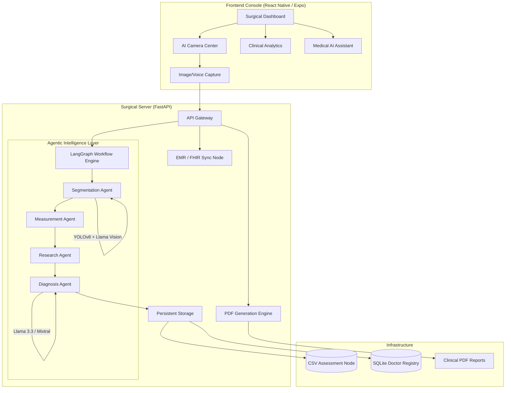

# WoundSense AI - Technical Documentation v4.1 Platinum

WoundSense AI is an industrial-grade, agentic medical suite designed for surgical wound assessment, patient care management, and clinical intelligence. It leverages a multi-agent LangGraph backend and a high-fidelity React Native frontend to provide real-time, AI-driven diagnostics.

---

## 🏗️ System Architecture

The application follows a specialized **Client-Agentic-Server** architecture.

---

## 🛠️ Technology Stack

### Frontend (Native Mobile Console)

- **Framework**: React Native with Expo SDK 52.
- **UI Architecture**: High-fidelity "Blinkit-style" vertical queue with premium micro-animations.
- **Styling**: Custom `Theme.js` system (Royal Medical Blue palette).
- **Icons**: Lucide-React-Native (Aliased for surgical consistency).
- **Internationalization**: `react-i18next` (Full English/Hindi switch).
- **3D Visualization**: `@react-three/fiber/native` for synthetic model viewing.

### Backend (Agentic Intelligence)

- **Framework**: FastAPI (Asynchronous Python).
- **Orchestration**: **LangGraph** (Stateful Multi-Agent Workflows).
- **AI Inference**: Groq Cloud SDK (Ultra-low latency inference).
- **Models**:
  - **YOLOv8**: For precise wound segmentation and masking.
  - **Llama 3.2 Vision**: Fallback auditor for visual analysis.
  - **Llama 3.3 / Mixtral-8x7b**: Clinical reasoning and report generation.
  - **Whisper Large v3 Turbo**: Real-time voice transcription.
- **Persistence**: Hybrid storage via CSV (Assessments) and SQLite (Doctor Authentication).
- **Communications**: SMTP integration for clinical OTP delivery.

---

## 🚀 Key Functions & Features

### 1. AI Wound Scanning Node

- **Dynamic Masking**: Segments wound boundaries in real-time.
- **Precise Metrics**: Calculates Area (cm²), Length, Width, and simulated Volume.
- **Four-Pillar Reporting**: Automatically parses AI output into:
  - Clinical Findings & Classification
  - Tissue Composition (Granulation/Slough)
  - Infection Risk & Exudate
  - MD Recommended Care Plan

### 2. Surgical Dashboard (Premium Console)

- **Collapsible History**: Manages visual clutter with smooth transitions.
- **Analytics Center**: Visualizes success rates, healing trends, and Wagner Grade breakdowns.
- **FHIR Sync Node**: Visualizes HL7 v2.5 / FHIR R4 interoperability logs.
- **Registry Access (MCP)**: Search PubMed, FDA registries, and ICD-10 codes via a specialized Model Context Protocol interface.

### 3. Patient Care Management

- **Registry Node**: Dedicated interface for registering new patients with country-code validation.
- **Surgical Timeline**: Detailed chronological view of all assessments for a specific patient.
- **Secure Handling**: HIPAA-compliant simulation for data persistence.

### 4. AI Expert Assistant

- **Voice-Enabled**: Surgeons can consult the AI via voice or text.
- **Multilingual Support**: Switch seamlessly between English and Hindi.
- **Surgical Logic**: Trained to provide concise, evidence-based recommendations.

---

## 📄 Output & Evidence

- **Industrial PDFs**: Generates structured clinical reports including patient images, measurements, and a "Licensed Medical Officer" signature line.
- **CSV Audit Logs**: Every scan is permanently recorded for surgical audit purposes.

---

> [!IMPORTANT]
> **Production Compliance**: This application is built with a "Clinical First" philosophy, ensuring that even if one AI model fails (e.g., YOLO), a fallback Vision Auditor (Llama) maintains system integrity.
